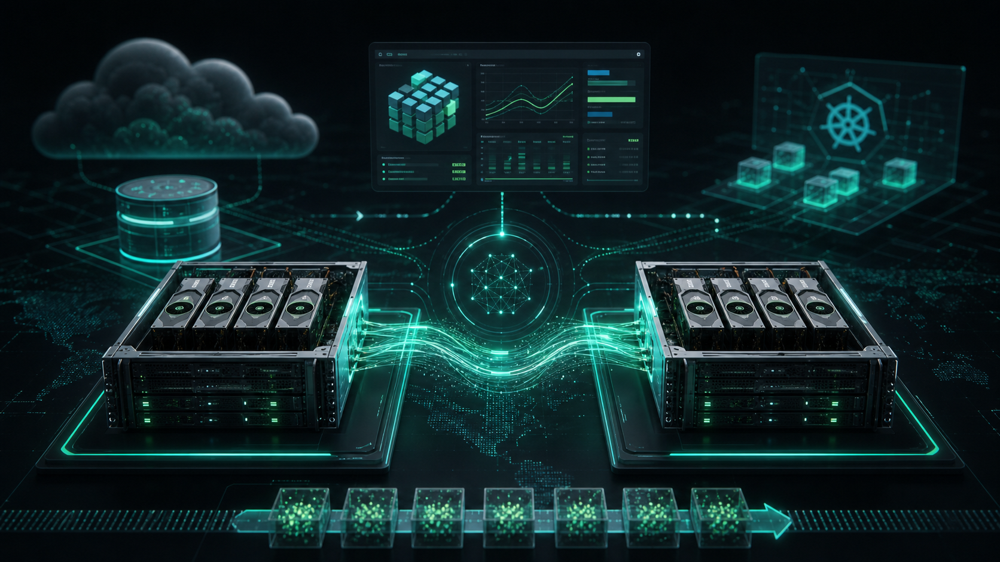
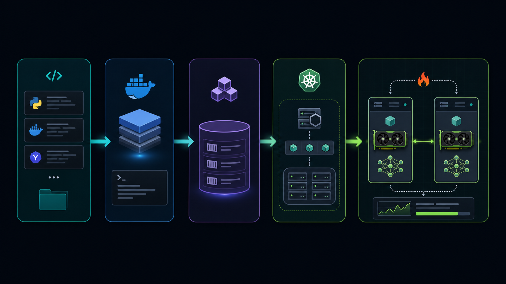
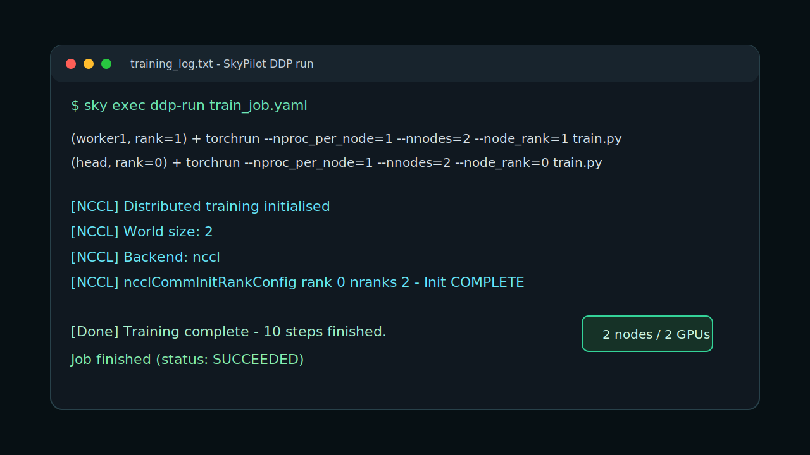

# Nebius Academy DDP Training

[](https://github.com/sapir-pirski/distributed-gpu-ddp-training/actions/workflows/ci.yml)



This repository contains a completed distributed GPU training pipeline for the Nebius Academy DDP assignment. The project builds a Docker image, pushes it to Nebius Container Registry, provisions a two-node GPU Kubernetes node group, and runs a multi-node PyTorch Distributed Data Parallel job through SkyPilot.

The successful run used two separate H200 GPU nodes, one GPU per node, with `torchrun` and the NCCL backend. The captured log proves `World size: 2`, NCCL initialization, training completion, and a successful SkyPilot job status.

## Result

| Area | Value |
| --- | --- |
| Cloud | Nebius AI Cloud |
| Region | `eu-north1` |
| Registry | `cr.eu-north1.nebius.cloud/e00avpz7r2gn4zffdk` |
| Image | `nebius-trainer:v1` |
| Kubernetes cluster | `nebius-ddp-mk8s` |
| Node group | `nebius-ddp-h200-ng` |
| GPU platform | NVIDIA H200 NVLink |
| Distributed runtime | PyTorch DDP via `torchrun` |
| Launcher | SkyPilot on Kubernetes |
| Final status | `SUCCEEDED` |

## Cost And Cleanup

This project provisions paid cloud resources. The most expensive resource is the two-node H200 GPU node group used for DDP training, but the Kubernetes cluster, registry image storage, disks, and SkyPilot runtime can also leave billable resources behind.

`cleanup-sky` only shuts down the SkyPilot runtime:

```bash
./run-full-project.sh cleanup-sky
```

To delete the cloud resources configured for this project, use the guarded cleanup command:

```bash
CONFIRM_DELETE_CLOUD=1 ./run-full-project.sh cleanup-cloud
```

The confirmation flag is required because this command deletes real cloud resources: the SkyPilot runtime, Kubernetes cluster, GPU node group, registry artifacts, and registry configured by the IDs at the top of `run-full-project.sh`.

Verify cleanup with:

```bash
./run-full-project.sh verify-cloud-cleanup
```

Expected result:

```text
No SkyPilot clusters
No Kubernetes clusters
No container registries
No compute instances
No compute disks
```

`cleanup-sky` alone is not enough to stop all charges.

## Architecture



The pipeline is intentionally simple and reproducible:

1. `Dockerfile` builds the CUDA/PyTorch training image.
2. The image is pushed to Nebius Container Registry.
3. Nebius Managed Kubernetes provides the GPU node group.
4. NVIDIA GPU Operator exposes GPU resources to Kubernetes.
5. SkyPilot syncs the local workdir and launches two pods, one per node.
6. `torchrun` starts rank 0 and rank 1 processes.
7. `train.py` initializes NCCL and fine-tunes `facebook/opt-1.3b` for a short validation run.
8. `training_log.txt` captures the full run output.

## Run Evidence



Key lines from `training_log.txt`:

```text
(worker1, rank=1) + torchrun --nproc_per_node=1 --nnodes=2 --node_rank=1 ...
(head, rank=0)    + torchrun --nproc_per_node=1 --nnodes=2 --node_rank=0 ...
[NCCL] Distributed training initialised
[NCCL] World size: 2
[NCCL] Backend: nccl
[Done] Training complete - 10 steps finished.
Job finished (status: SUCCEEDED)
```

The SVG above is a terminal-style capture generated from the real training log. No browser screenshots were stored locally during the cloud run.

## Deliverables

The assignment asks for a zip archive containing exactly these five files:

```text
mk8s-ng-config.json
Dockerfile
train.py
train_job.yaml
training_log.txt
```

The archive itself is generated output and is not kept in the repo. Recreate the exact assignment archive with:

```bash
./run-full-project.sh package-submission
```

The command removes any old archive, creates a new zip with exactly the five required files, validates it with `scripts/validate_project.py`, and prints the final contents:

```text
mk8s-ng-config.json
Dockerfile
train.py
train_job.yaml
training_log.txt
```

## Repository Layout

```text
.
|-- assets/
|   |-- ddp-architecture.png
|   |-- ddp-pipeline.png
|   `-- run-evidence.svg
|-- Dockerfile
|-- requirements.txt
|-- mk8s-ng-config.json
|-- train.py
|-- train_job.yaml
|-- training_log.txt
|-- run-full-project.sh
|-- TASK.md
|-- licence.md
`-- README.md
```

## Important Files

`Dockerfile` uses the NVIDIA PyTorch container base image and installs the pinned Python dependencies from `requirements.txt`.

`requirements.txt` pins the Hugging Face, Datasets, Accelerate, PEFT, TRL, bitsandbytes, W&B, and SciPy versions extracted from the successful training image. PyTorch, CUDA, and NCCL are provided by the NVIDIA base image.

`train.py` initializes a distributed NCCL process group, loads `facebook/opt-1.3b`, tokenizes Wikitext, and trains with Transformers `Trainer`.

`train_job.yaml` is the SkyPilot task. It targets the Kubernetes context, requests `H200:1` per node, sets `num_nodes: 2`, and launches `torchrun`.

`mk8s-ng-config.json` is the exported Nebius node-group metadata/spec for the successful two-node GPU node group.

`training_log.txt` is the successful SkyPilot log with NCCL initialization and DDP completion.

`run-full-project.sh` documents the full pipeline and provides executable subcommands for local checks, Docker image work, SkyPilot launch, log capture, packaging, and cleanup.

## Local Verification

Run:

```bash
./run-full-project.sh verify-local
```

This checks:

1. `train.py` compiles.
2. `mk8s-ng-config.json` is valid JSON.
3. `training_log.txt` includes NCCL/DDP success evidence.
4. The expected submission file list is printed if the zip exists.

## Reproducing the Cloud Run

The full run requires Docker, Nebius CLI, kubectl, Helm, SkyPilot, a valid Nebius login, a kubeconfig for the cluster, and project access.

Print the exact step-by-step procedure:

```bash
./run-full-project.sh print-steps
```

Selected commands:

```bash
docker build --platform linux/amd64 -t nebius-trainer:local .
docker tag nebius-trainer:local cr.eu-north1.nebius.cloud/e00avpz7r2gn4zffdk/nebius-trainer:v1
docker push cr.eu-north1.nebius.cloud/e00avpz7r2gn4zffdk/nebius-trainer:v1

.venv/bin/sky check kubernetes
.venv/bin/sky launch -c ddp-run train_job.yaml -y
.venv/bin/sky logs ddp-run > training_log.txt
```

## External References

Official documentation:

- [Nebius Managed Service for Kubernetes](https://docs.nebius.com/kubernetes)
- [Nebius Container Registry](https://docs.nebius.com/container-registry)
- [Nebius GPUs in Managed Kubernetes](https://docs.nebius.com/kubernetes/gpu/set-up)
- [Nebius NCCL tests on GPU Kubernetes clusters](https://docs.nebius.com/kubernetes/gpu/nccl-test)
- [SkyPilot YAML specification](https://docs.skypilot.co/en/latest/reference/yaml-spec.html)
- [SkyPilot installation](https://docs.skypilot.co/en/latest/getting-started/installation.html)
- [PyTorch DDP tutorial](https://docs.pytorch.org/tutorials/intermediate/ddp_tutorial.html)

Popular GitHub repositories used as implementation references:

- [skypilot-org/skypilot](https://github.com/skypilot-org/skypilot) - SkyPilot orchestration, Kubernetes support, examples, and YAML model.
- [huggingface/transformers](https://github.com/huggingface/transformers) - model loading and `Trainer` API.
- [pytorch/pytorch](https://github.com/pytorch/pytorch) - PyTorch and `torch.distributed`.
- [pytorch/examples](https://github.com/pytorch/examples) - reference PyTorch training examples.
- [NVIDIA/gpu-operator](https://github.com/NVIDIA/gpu-operator) - Kubernetes GPU operator.
- [NVIDIA/nccl](https://github.com/NVIDIA/nccl) - collective GPU communication library used by the NCCL backend.
- [kubeflow/trainer](https://github.com/kubeflow/training-operator) - Kubernetes-native distributed AI training reference.

GitLab references:

- [jadnov/nebius-academy-ddp](https://gitlab.com/jadnov/nebius-academy-ddp) - assignment reference repository listed in `TASK.md`.
- [nvidia/container-images/cuda](https://gitlab.com/nvidia/container-images/cuda) - CUDA container image reference.
- [gitlab-org/gitlab-runner](https://gitlab.com/gitlab-org/gitlab-runner) - useful reference for CI/CD automation around packaging and validation.

## Visual Assets

The two PNG illustrations in `assets/` were AI-generated for this README and saved into the project:

- `assets/ddp-architecture.png`
- `assets/ddp-pipeline.png`

The run-evidence SVG was generated locally from `training_log.txt`.
